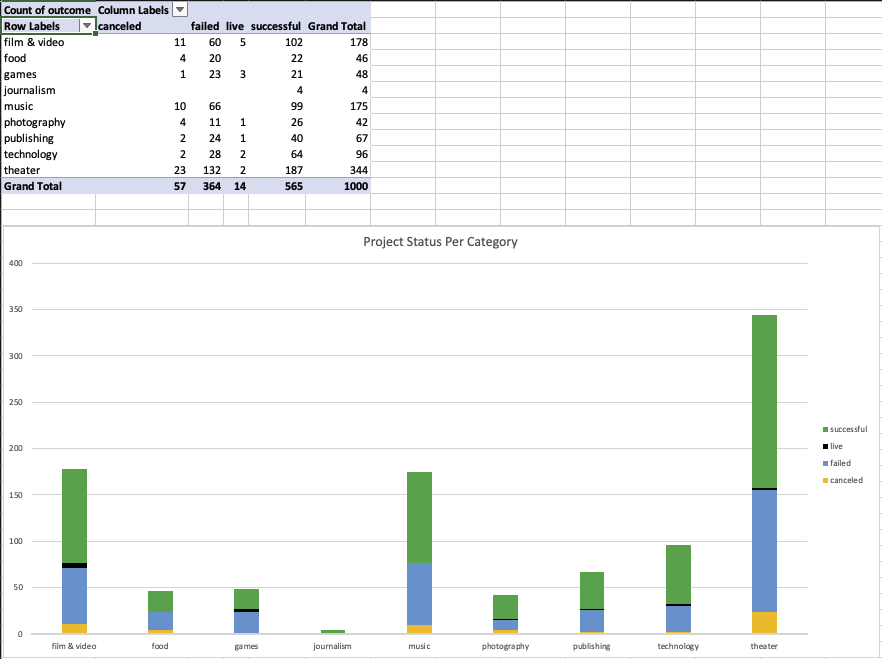
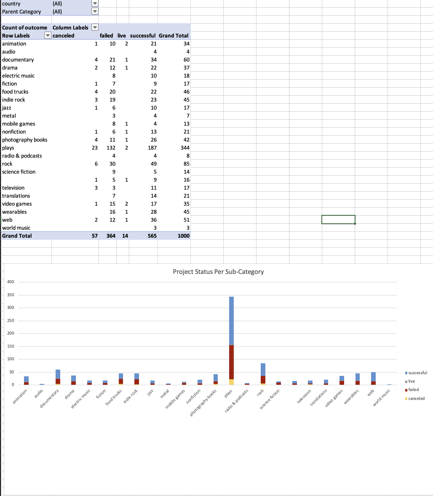
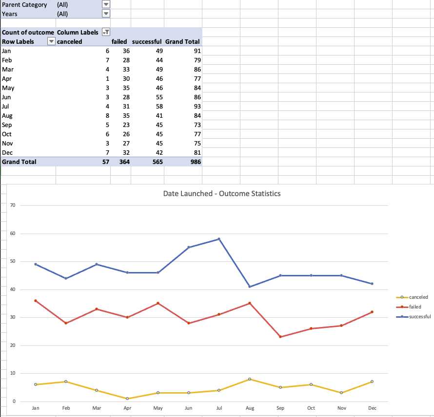
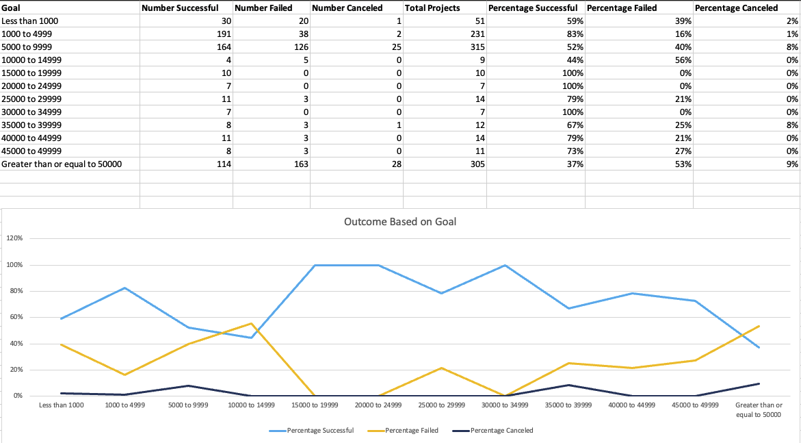
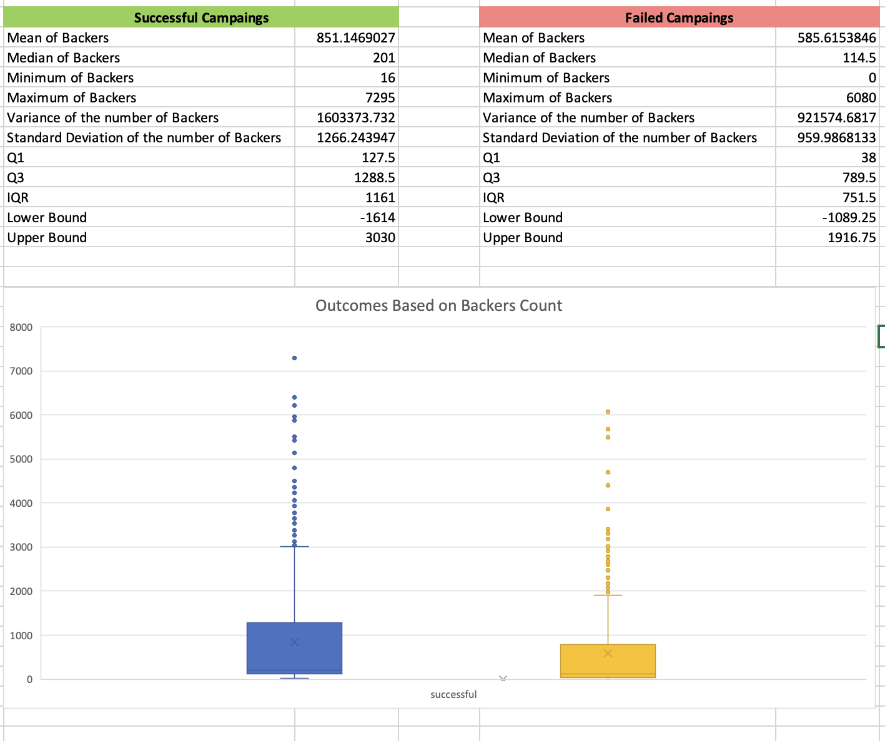

# Crowdfunding Analysis

The aim of this project is to analyze crowdfunding platforms like Kickstarter and Indigogo to make sound observations based on the data and help determine any trends to a successful campaign.

## Observations
From the Category Analysis, ***journalism campaigns have a 100% success rate, while games has the least success rate of 43%.*** *Campaigns with success rate >= 60% are photography and publishing.*

From the Sub-Category Analysis, ***audio and world music have a 100% success rate, while mobile games campaign has the least success rate of 30%.*** *Campaigns with >= 60% success rate are animation, non-fiction, photography books, television, translations, wearables and web.*

From the Outcome Based on Launch Date Analysis, ***June is the month with the highest success rate of 64% and August is the month with the least success rate of 48%.*** *Campaigns with success rate >= 60% were launched in the months of June, July, Spetember and November.* 

From the Crowndfunding Based on Goal analysis, it can be determined that ***campaigns with goals, 15000 to 19999, 20000 to 24999 and 30000 to 34999 have a success rate of 100%.*** And the ***campaigns with a goal of >= 50000 has the least success rate of 37%.***
*Campaigns with a success rate of >= 60% have a goal of $15000 upto $50000 and $1000 upto $5000.*

### Additional Columns 
---

Adding the success percentage for each of the pivot tables would greatly help in determining the best campaigns in category, sub-category, outcomes based on launch date and outcomes based on goal amount. 

## Statistical Analysis Observation
I think the ***Median value better summarizes the data***, as it can be used to present the data as a normal distribution, with values of the dataset falling equally on both sides of the median.  

We have a total of 565 successful campaigns based on backers count. Out of which 282 are less than 201 (median) and 283 are greater than 201 (median) which presents an equal distribution of the dataset.

We have a total of 364 failed campaigns based on backers count. Out of which, 181 are less than 114 (median) and 183 are more than 114 (median), which presents an equal distribution of the dataset. 

I believe there is more or less *equal variability with both successful and failed campaigns.*

## How to install and run the code

1. Ensure the git link has the *Crowdfunding_Analysis.xlsx* excel workbook
2. Git clone the link into your local repo
3. Open the excel workbook using Excel program in your system
4. Verify all computed additional columns, worksheets, pivot tables and charts are present

## Credits

I've had a tutoring session, where the tutor pointed me to a youtube video that had the solution for the project, but it wasn't complete and I used it only to verify, my method of approach was correct.
Additionally, I used the knowledge from the third class to compute the statistical analysis worksheet.

## References

https://www.google.com/search?q=how+do+you+split+a+column+into+two+in+excel&rlz=1C5GCEM_enUS1059US1059&oq=how+do+you+split+a+column+&gs_lcrp=EgZjaHJvbWUqDAgDEAAYFBiHAhiABDIGCAAQRRg5MgwIARAAGBQYhwIYgAQyBwgCEAAYgAQyDAgDEAAYFBiHAhiABDIHCAQQABiABDIHCAUQABiABDIICAYQABgWGB4yCAgHEAAYFhgeMggICBAAGBYYHjIICAkQABgWGB7SAQkxNjM0OGowajeoAgCwAgA&sourceid=chrome&ie=UTF-8

https://www.google.com/search?q=how+do+I+remove+the+accounting+%24+sign+from+my+column+in+excel&rlz=1C5GCEM_enUS1059US1059&oq=how+do+I+remove+the+accounting+%24+sign+from+my+column+in+excel&gs_lcrp=EgZjaHJvbWUyBggAEEUYOdIBCTE0MTY5ajBqN6gCALACAA&sourceid=chrome&ie=UTF-8

https://www.google.com/search?q=how+to+create+a+stacked+bar+chart+in+excel+pivot&rlz=1C5GCEM_enUS1059US1059&sxsrf=AB5stBjNheF9B8yWjE7IHbkTRe2wjwcs0A%3A1689560904532&ei=SKe0ZLaKIPzbkPIP0b6LgA4&oq=how+to+create+a+stacked+bar+chart+in+excel+&gs_lp=Egxnd3Mtd2l6LXNlcnAiK2hvdyB0byBjcmVhdGUgYSBzdGFja2VkIGJhciBjaGFydCBpbiBleGNlbCAqAggDMgUQABiABDIKEAAYgAQYFBiHAjIFEAAYgAQyBRAAGIAEMgUQABiABDIGEAAYFhgeMgYQABgWGB4yBhAAGBYYHjIGEAAYFhgeMgYQABgWGB5ImzFQtxRYtxRwAXgBkAEAmAFPoAFPqgEBMbgBAcgBAPgBAcICChAAGEcY1gQYsAPCAgoQABiKBRiwAxhD4gMEGAAgQYgGAZAGCg&sclient=gws-wiz-serp#kpvalbx=_nKe0ZIvxJuHv0PEP1oW2yAU_35

https://www.extendoffice.com/documents/excel/2473-excel-timestamp-to-date.html

https://www.mrexcel.com/board/threads/pivot-table-doesnt-see-inserted-column.303431/

https://support.microsoft.com/en-au/office/filter-data-in-a-pivottable-cc1ed287-3a97-4e95-b377-ddfafe79fa8f

https://www.youtube.com/watch?v=6n-yAz3w5w0&ab_channel=TheBootCamp

